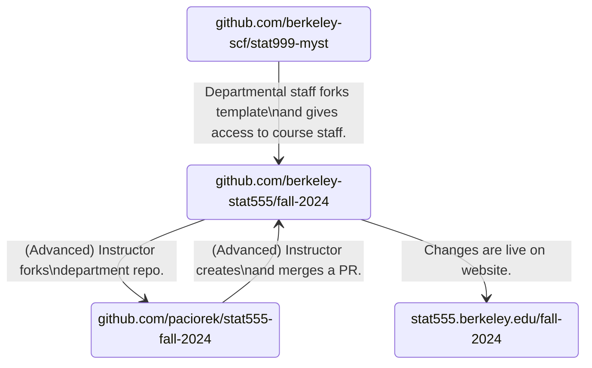

# stat999-myst

This repository contains a MyST-based template for class website. You can see a preview of it at [https://berkeley-scf.github.io/stat999-myst](https://berkeley-scf.github.io/stat999-myst). This template is intended to be forked and altered for other courses.

## Capabilities of this MyST-based Template

- Create a website by modifying content in a GitHub repository.
- Create documents from markdown files or Jupyter notebooks.
- Include LaTeX and LaTeX macros for mathematical notation.
- Embed live python kernels via JupyterLite.
- Embed external webpages (such as Google calendars) as iframes within a page.
- Render documents as HTML or PDF (the latter for documents that students will download).
- Render a schedule from a YAML file.
- MyST Markdown includes various nice features such as automatic navigation links, callouts, tables, images, code blocks, diagrams, etc. It also has a plugin system which enables you to create custom features.


## Terminology

- "Rendering" a document or a site involves converting the *source* markdown or notebook files to html.
- "Previewing" a site involves rendering the site and displaying it locally on your computer (i.e., at `localhost:<port>` in a web browser.
- "Publishing" a site involves pushing the rendered site to the `gh-pages` branch of the GitHub repository so it can be viewed at the public URL.


## Workflow Overview

The anticipated workflow is that departmental staff will fork this template into a new repo resembling https://github.com/berkeley-stat555/fall-2024. The instructor (and course staff of their choosing) will be given permission to modify that repo. More advanced users may choose to fork that into their own github account and make pull requests into the class repo.

For example, given the instructor with github handle `@paciorek`:


Theoretically, the instructor could ask the SCF to fork from the previous term's repo, e.g. github.com/berkeley-stat555/spring-2024, rather than the template.

The instructor may choose to require that GSIs operate in their own forks, if they wanted more control or to review changes more formally.

## Instructions for Department Staff

1. Create a github organization for the course if one does not already exist. It should be named `berkeley-statNNN` where `NNN` is the course number.

1. If it was necessary to create a new github organization, create a course overview repository and website as well.

   a. Instantiate the template at https://github.com/berkeley-scf/course-overview into the new organization.

   a. Complete the course overview section and make other course-specific adjustments.

   a. Create a .stat subdomain CNAME for statNNN.stat.berkeley.edu for the course in DNS if one does not already exist. See GitHub's [instructions](https://docs.github.com/en/pages/configuring-a-custom-domain-for-your-github-pages-site/managing-a-custom-domain-for-your-github-pages-site#configuring-a-subdomain).

   a. Add the CNAME to https://github.com/berkeley-statNNN/course-overview/settings/pages > Custom domain. This will add a `CNAME` file to the repository.

   a. Request a top-level CNAME for statNNN.berkeley.edu pointing at statNNN.stat.berkeley.edu.

1. Fork this `stat999-myst` repository template:

   a. Visit https://github.com/berkeley-scf/stat999-myst.

   b. Above the file list click **Use this template** and then **Create a new repository**. This will then bring you to a screen where you'll configure the new repository.

   c. Do not enable the **Include all branches** checkbox.

   d. Name the repository after academic term, e.g. `fall-2024` and place it into the per-course organization, e.g. `berkeley-statNNN`.

   e. You might choose the default of having your repository be public or choose that it be private while you are setting things up. Or you might choose for it always to be private.

   f. Click on **Create Repository**.

1. Enable GitHub Pages in the repository. Go to Settings > Pages > Source > GitHub Actions (Beta). Because a github action is contained within the template, it will run when the template is instantiated and may fail until this step is completed.

## Instructions for Course Staff

These instructions have been tested under macOS.

### Edit the Content
1. When department staff notify you that the class repository is ready, clone it into a local working directory on your computer. For the purposes of these instructions, we'll pretend your repository is at https://github.com/berkeley-stat555/fall-2024.
   - You can do this from the terminal/commandline or within a Git graphical application (e.g., `GitHub Desktop`).
   - From the terminal it would look like this:
     ```bash
     git clone https://github.com/berkeley-stat555/fall-2024
     cd fall-2024
     ```
   If you need to maintain several of these websites and there is a conflict in working directory names, you can just rename the working directory after cloning it, e.g. `mv fall-2024 stat555-fall-2025; cd stat555-fall-2024`.


1. Begin making changes relevant to your course.
   - Modify the site's metadata in `myst.yml`. Notable fields include the course title, description, author, and github URL. You can also edit links to external resources for your course, such as bCourses and Ed.
   - Modify the table of contents in `_toc.yml` to reflect the structure you want.
   - Edit the other markdown files in the working directory and add new markdown or jupyter notebook files as desired.
   - Update `index.md` to reflect the material you want displayed in the main page.
   - You can make use of various MyST features discussed in the [MyST Guide](https://mystmd.org/guide).


1. Update your repository with the changes to your source files. First tell git about all files that should be in your repo.

   ```bash
   git add NEWFILE1.md NEWFILE2.md NEWDIRECTORY
   ```

   Then commit your changes:
   ```bash
   git commit -m "Initial checkin for Stat 555."
   ```

   If you modify an existing file, you can either do `git add currentfile.md` or include the `-a` flag when you run `git commit` to automatically update files that Git is already keeping track of, e.g., after modifying unit 7 files, `git commit -am "Updated Unit 7"`.


### Preview Changes

If you want to preview the website locally on your own computer before they go live, follow these instructions. It is not strictly necessary, but we recommend doing so to spot errors. If you are confident that your changes will not break anything (for example for quick fixes), you can skip this section.

1. Install a Conda distribution, such as [Miniforge](https://github.com/conda-forge/miniforge) or [Anaconda](https://www.anaconda.com/download#downloads), if you don't already have one installed.


1. Install software using conda/mamba. To preview the website on your own device you will need some command-line programs such as `nodejs` and [myst](https://mystmd.org/guide/quickstart). We have provided an `environment.yml` file to make this step simpler. Run the commands below to install all dependencies in a separate environment, and then activate it. This keeps your website development separate from any other projects you're working on.
     ```bash
     # You can replace `mamba` with `conda`.
     mamba env create -f environment.yml
     
     # Now you can activate the environment.
     # You can use `mamba activate` or `conda activate`,
     # but these require that you have run `mamba init` or `conda init`,
     # which modifies your shell.
     mamba activate stat-myst-site
     
     # Alternatively, you can activate like this, without
     # having do the `init` step mentioned above.
     source activate stat-myst-site
     ```

   Whenever you need to start up a new terminal to work on your website, first activate the the environment that contains the necessary programs with `mamba activate stat-myst-site`. Otherwise your terminal may report that it cannot find `myst` or its dependencies.


1. Preview your changes on your own device. Run `myst init` in the working directory to initialize your working directory. When prompted, let the command run `myst start` for you to generate a preview. `myst` will display a localhost URL where the site preview is running, such as http://localhost:3000. Open this URL in your browser.

   **Note:** When `myst` detects problems in the markdown that prevent the website from rendering correctly, it will print the file and line number containing the issue. If this happens, fix the file and rerun `myst init`.

   **Note:** If you are on a Mac, `myst` may prompt you to allow `node` to accept incoming network connection. Allow this to enable website previewing to work.

   You can leave `myst` running as you make changes to the source files; saving changes to the source files will generally will be reflected live in your browser, though you may sometimes need to navigate away and back or reload the page.

   You can also run `myst build` to create the static HTML (in the `_build` directory) without automatically displaying it.

   **Note:** Do not commit the files in `_build` to your repository. They will not be used when the website is deployed. Rather, an automated process via GitHub Actions will run and create the static build files.


### Push Your Changes

1. Push your changed to github:
   ```bash
   git push
   ```
   This will cause GitHub to rebuild your site.

1.  You can observe the build process at github by clicking on the Actions button at the top of your repository, e.g. https://github.com/berkeley-stat555/fall-2024/actions. It usually takes a couple of minutes for this to complete. If there are no problems, your website will be publicly available at https://stat555.berkeley.edu/fall-2024.


The SCF is happy to help. Please [contact us](https://statistics.berkeley.edu/computing/how-get-help) if you are a Berkeley Statistics instructor and you run into problems or questions.
